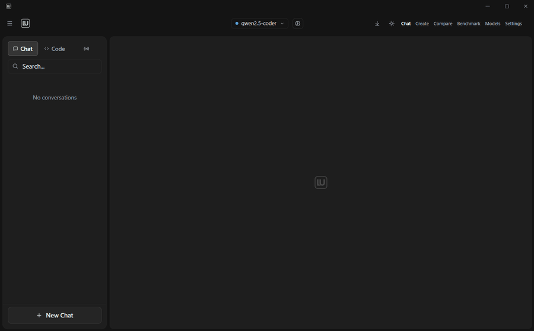

<div align="center">


# Locally Uncensored

**Generate anything — text, images, video. Locally. Uncensored.**

No cloud. No data collection. No API keys. Auto-detects 12 local backends. Your AI, your rules.

[](https://www.gnu.org/licenses/agpl-3.0)
[](https://github.com/PurpleDoubleD/locally-uncensored/stargazers)
[](https://github.com/PurpleDoubleD/locally-uncensored/commits)
[](https://github.com/PurpleDoubleD/locally-uncensored/discussions)
[](https://locallyuncensored.com/discord)
[](https://locallyuncensored.com)



*The only desktop app that runs AI chat, image, and video generation — locally, one click, no cloud.*

[Download](#-download) · [Features](#-features) · [Quick Start](#-quick-start) · [Why This App?](#-why-locally-uncensored) · [Roadmap](#-roadmap)

</div>

---

### Screenshots

| Chat with Personas | Image / Video Generation |
|:---:|:---:|
|  |  |
| **Model Manager** | **Create View with Parameters** |
|  |  |

---

## v2.4.4 — Current Release

**Hotfix: 8 fixes for the v2.4.3 follow-up sweep.**

Drop-in hotfix on top of v2.4.3. Auto-update prompts on next launch.

Reports collected on Discord, Reddit, and GitHub Discussions between 2026-05-04 and 2026-05-11. Thanks to **techx69**, **ninjastic2008**, **phantomderp**, **vokurta**, **vvvxxxvvv_80435**, and **Turbulent_Tomato7559** for the repros.

### What's fixed
- **LM Studio system-wide install now detected** (techx69) — `lmstudio_lms_path()` walks `%PROGRAMFILES%`, `%PROGRAMFILES(X86)%`, `%PROGRAMW6432%`, plus a registry sweep of `Uninstall\…\InstallLocation`. Soft-detect via a bounded walk of `~/.lmstudio/models/` for GGUFs means users with models on disk but the server down get a **"Start LM Studio server"** primary CTA instead of "no models found".
- **Multi-ComfyUI picker in onboarding** (ninjastic2008) — new `detect_all_comfyui_installs` enumerates every ComfyUI on disk with provenance tags (config.json, deep home scan, etc.). When more than one match exists the user picks explicitly; single-hit and zero-hit cases keep the previous auto-pick / install-fresh flow.
- **ComfyUI install: Cancel + disk-pressure pre-flight + ETA** (techx69) — the 45-min hang case now has a Cancel button (cleanly kills git/pip child via `Arc<AtomicBool>` poll), a `< 5 GB free` warning before the pip step kicks off, and a rolling ETA next to the elapsed timer.
- **PyTorch wheels respect GPU compute capability** (vokurta — RTX 6000 Blackwell) — `nvidia-smi --query-gpu=compute_cap` routes SM 12.0+ to `cu128`, everything else to `cu121`. Fixes `CUDA error: no kernel image is available for execution on the device` on Blackwell silicon.
- **TokenCounter respects the Settings `maxTokens` override live** (phantomderp) — header re-renders on every settings tick instead of caching the model manifest value at mount.
- **DownloadBadge X-button cancels the Rust pull stream** (phantomderp) — `dismissPull` now aborts the `AbortController` AND invokes `cancel_model_pull`. No more respawn from late `pull-progress` events, no more half-installed models in Ollama.
- **Agent-Mode hint when a model emits `<tool_call>` JSON without the toggle on** (phantomderp) — amber banner with a one-click "Enable Agent" button instead of rendering raw JSON.
- **Video workflow architecture install hints + .webp warning** (vvvxxxvvv_80435, Turbulent_Tomato7559) — CogVideoX, FramePack, Pyramid Flow, and Allegro throw a typed `WorkflowUnavailableError` with `installHint: { pack, url }` when their wrapper nodes are missing instead of producing the cryptic "could not detect model type" error or an animated `.webp` instead of an `.mp4`. The Create flow also warns up front when `VHS_VideoCombine` is missing.

### Stability
- `vitest`: 93 files / 2264 tests green (+10 vs. v2.4.3 for cancel propagation and install-hint coverage)
- `cargo test --release`: 52 passed (+8 for `parse_compute_cap_output` covering Ampere / Ada / Hopper / Blackwell / multi-GPU pick-highest / edge cases)
- `tsc --noEmit`: clean, `cargo check`: clean (1 dead-code warning, pre-existing)
- Phase 1 + Phase 2 live-E2E via Computer-Use: 5/8 bugs verified live in both configured-state and complete-fresh-state runs. 3 remaining (ComfyUI install cancel, wrapper workflows, Blackwell wheels) are code + unit-test verified — invasive to validate live without Blackwell silicon, a 100%-busy drive, or CogVideoX wrapper nodes installed.
- No breaking changes, no localStorage migration — upgrade in place.

### Heads-up
Same as the v2.4.3 sweep: `#bug-reports` / `#help-*` / GitHub will be checked daily for the next few days for any regression. v2.4.4 is a Windows + Linux release; macOS is not part of this build.

For older releases, see [CHANGELOG.md](CHANGELOG.md).

---

## Why Locally Uncensored?

| Feature | Locally Uncensored | Open WebUI | LM Studio | SillyTavern |
|---------|:-:|:-:|:-:|:-:|
| AI Chat | **Yes** | Yes | Yes | Yes |
| **Coding Agent (Codex)** | **Yes** | No | No | No |
| **14 Agent Tools + MCP** | **Yes** | No | No | No |
| **Plug & Play Setup** | **12 Backends** | No | Built-in | No |
| **Multi-Provider** (20+ Presets) | **Yes** | Yes | Yes | No |
| **A/B Model Compare** | **Yes** | No | No | No |
| **Local Benchmark** | **Yes** | No | No | No |
| Image Generation | **Yes** | No | No | No |
| **Image-to-Image** | **Yes** | No | No | No |
| **Image-to-Video** | **Yes** | No | No | No |
| Video Generation | **Yes** | No | No | No |
| **File Upload + Vision** | **Yes** | Yes | Yes | No |
| **Thinking Mode** | **Yes** | No | No | No |
| **Granular Permissions** | **7 Categories** | No | No | No |
| Uncensored by Default | **Yes** | No | No | Partial |
| Memory System | **Yes** | Plugin | No | No |
| Agent Workflows | **Yes** | No | No | No |
| Document Chat (RAG) | **Yes** | Yes | No | No |
| Voice (STT + TTS) | **Yes** | Partial | No | No |
| **Remote Access (Phone)** | **Yes** | No | No | No |
| **Plugins (Caveman + Personas)** | **Yes** | No | No | Yes |
| **Auto-Update** | **Yes** | No | Yes | No |
| Open Source | **AGPL-3.0** | MIT | No | AGPL |
| No Docker | **Yes** | No | Yes | Yes |

---

## Features

### Core
- **Plug & Play Setup** — First-launch wizard auto-detects 12 local backends. Nothing installed? One-click in-app Ollama download and install with progress bar. ComfyUI one-click install with step-by-step progress. Configurable ComfyUI port and path in Settings. Zero config needed.
- **Uncensored AI Chat** — Abliterated models with zero restrictions. Streaming + thinking display.
- **Multi-Provider** — 20+ presets. Local: Ollama, LM Studio, vLLM, KoboldCpp, llama.cpp, LocalAI, Jan, TabbyAPI, GPT4All, Aphrodite, SGLang, TGI. Cloud: OpenAI, Anthropic, OpenRouter, Groq, Together, DeepSeek, Mistral. Switch per conversation.
- **Codex Coding Agent** — Live streaming between tool calls, continue capability, AUTONOMY CONTRACT. File tree, folder picker, up to 50 iterations.
- **Agent Mode** — 14 tools + MCP: web search/fetch, file I/O, shell, code execution, screenshots, system info, time. Parallel execution, sub-agents, budget system.
- **Remote Access** — Access your AI from your phone via LAN or Cloudflare Tunnel. Full mobile web app with Agent Mode, Codex, plugins, file attach.
- **Image Generation** — FLUX 2 Klein, FLUX.1 (schnell/dev), Z-Image Turbo/Base, Juggernaut XL, RealVisXL, DreamShaper XL via ComfyUI. Full parameter control, no content filter.
- **Image-to-Image** — Upload a source image, adjust denoise strength, transform with any image model.
- **Video Generation** — Wan 2.1, HunyuanVideo 1.5, LTX 2.3, AnimateDiff Lightning, CogVideoX, FramePack F1 on your GPU.
- **Image-to-Video** — FramePack F1 (6 GB VRAM), CogVideoX 5B, SVD-XT. Upload an image, get video.

### Intelligence
- **Thinking Mode** — Provider-agnostic. See the AI's reasoning before the answer. Toggle from chat input.
- **File Upload + Vision** — Drag & drop, paste, clip button. Vision models analyze images.
- **Granular Permissions** — 7 tool categories, 3 permission levels, per-conversation overrides.
- **Smart Tool Selection** — Reduces tool definitions per request by ~80%. JSON repair for local LLMs.
- **Memory System** — Persistent across conversations. Auto-extraction. Export/import.
- **Agent Workflows** — Multi-step chains. 3 built-in (Research, Summarize URL, Code Review). Visual builder.

### Productivity
- **Model A/B Compare** — Same prompt, two models, side by side. Parallel streaming.
- **Local Benchmark** — One-click benchmark any model. Tokens/sec leaderboard.
- **Document Chat (RAG)** — Upload PDFs, DOCX, TXT. Hybrid search with source citations.
- **Voice Chat** — Push-to-talk STT + sentence-level TTS streaming.
- **20+ Personas** — Pre-built characters. Switch without prompt engineering.
- **Chat Export** — Markdown or JSON. Token counter. Keyboard shortcuts.

### Customization
- **Plugins Dropdown** — Caveman Mode (Off/Lite/Full/Ultra for terse responses) + 20+ Personas in one menu. Per-chat. Works in Chat, Agent, Codex.
- **Auto-Update** — Signed NSIS installer. In-app download with progress bar. User-controlled restart (no forced updates). Settings survive updates.

### Polish
- **Standalone Desktop App** — Tauri v2 Rust backend. Download .exe, run it.
- **Model Load/Unload** — iOS-style toggle in header. Load into VRAM, unload when done.
- **AE-Style Header** — Clean typography navigation. Models, Settings, Downloads at a glance.
- **Privacy First** — Zero tracking, all API calls proxied locally. ComfyUI process auto-killed on app close.

## Tech Stack

- **Desktop**: Tauri v2 (Rust backend, standalone .exe)
- **Frontend**: React 19, TypeScript, Tailwind CSS 4, Framer Motion
- **State**: Zustand with localStorage persistence
- **AI Backend**: 20+ providers (Ollama, LM Studio, vLLM, KoboldCpp, llama.cpp, LocalAI, Jan, OpenAI, Anthropic, OpenRouter, Groq, and more), ComfyUI, faster-whisper
- **Build**: Vite 8 (dev), Tauri CLI (production)

---

## Download

### Windows
Download the installer from [Releases](https://github.com/PurpleDoubleD/locally-uncensored/releases/latest):
- **`.exe`** — NSIS installer (recommended)
- **`.msi`** — Windows Installer

> **Other platforms:** The source code builds on Linux and macOS via `npm run tauri build`, but only Windows is officially tested and supported.

> **Plug & Play:** Just install and launch. The setup wizard auto-detects all 12 supported local backends ([Ollama](https://ollama.com/), [LM Studio](https://lmstudio.ai/), [vLLM](https://github.com/vllm-project/vllm), [KoboldCpp](https://github.com/LostRuins/koboldcpp), llama.cpp, LocalAI, Jan, GPT4All, text-generation-webui, TabbyAPI, Aphrodite, SGLang). Nothing installed yet? The wizard shows one-click install links for every backend.

> **Antivirus warning?** Some engines (ESET, Avast, Microsoft SmartScreen) flag the installer as suspicious — this is a **false positive** caused by heuristics on unsigned NSIS installers that download other binaries. The installer is built by GitHub Actions from public source on `master` (`.github/workflows/release.yml`). The auto-update channel is signed against a public minisign key. Full context, verification steps, and one-click vendor submission links: see [SECURITY.md](SECURITY.md#antivirus--browser-false-positives).

---

## Quick Start

> **New to Locally Uncensored?** Read the [Getting Started Guide](https://locallyuncensored.com/guide/) with screenshots for every step.

### From Source

```bash
git clone https://github.com/PurpleDoubleD/locally-uncensored.git
cd locally-uncensored
npm install
npm run dev
```

### For Contributors — Dev-Mode Setup

> ⚠️ **Just want to use the app?** Grab the installer from [Releases](https://github.com/PurpleDoubleD/locally-uncensored/releases/latest) (the `.exe` or `.msi` in the **Download** section above). That gives you the full Tauri desktop app with auto-update. The commands below start LU in **browser dev-mode** — fewer features, Vite proxy noise, meant for contributing to the codebase.

```bash
git clone https://github.com/PurpleDoubleD/locally-uncensored.git
cd locally-uncensored
setup.bat   # Windows — installs Node, Git, Ollama, then npm run dev
# setup.sh  # macOS / Linux equivalent
```

Launches at `http://localhost:5173` in your default browser.

### Image & Video Generation

Open the **Create** tab. ComfyUI is auto-detected or one-click installed. Models download with one click. Workflow is set to **Auto** — just write a prompt and hit Generate.

---

## Recommended Models

### Text (any local backend)

| Model | VRAM | Best For |
|-------|------|----------|
| **Qwen 3.6 35B MoE** | 24 GB | Vision + agentic coding + thinking. Brand new. |
| **GLM-4.7-Flash IQ2** | 12 GB | Strongest 30B class. Tool calling. 198K context. |
| **Gemma 4 E4B** | 4 GB | Lightweight, fast, great for small GPUs. |
| **Qwen 3.5 35B MoE** | 16 GB | Best agentic, 256K context. SWE-bench leader. |
| **Gemma 4 31B** | 16 GB | Frontier dense model, native tools + vision. |
| Hermes 3 8B | 6 GB | Agent Mode. Uncensored + tool calling. |
| DeepSeek R1 (8B-70B) | 6-48 GB | Chain-of-thought reasoning. |

### Image (ComfyUI)

| Model | VRAM | Notes |
|-------|------|-------|
| FLUX.1 Schnell / Dev | 8-10 GB | Best text-to-image. Fast (schnell) or quality (dev). |
| FLUX 2 Klein 4B | 8-10 GB | Next-gen, fastest FLUX model. |
| ERNIE-Image Turbo | 24 GB | Baidu DiT, 8 steps, 1024x1024. New. |
| Z-Image Turbo | 10-16 GB | Uncensored, 8-15 sec per image. |
| Juggernaut XL V9 | 6 GB | Best photorealistic SDXL. |

### Video (ComfyUI)

| Model | VRAM | Notes |
|-------|------|-------|
| Wan 2.1 T2V 1.3B | 8-10 GB | Fast entry point, 480p. |
| Wan 2.1 T2V 14B | 12+ GB | High quality, 720p. |
| FramePack F1 (I2V) | 6 GB | Image-to-video, revolutionary low VRAM. |
| AnimateDiff Lightning | 6-8 GB | Ultra-fast 4-step animation. |
| HunyuanVideo 1.5 | 12+ GB | Excellent temporal consistency. |

---

## Roadmap

- [x] **Plug & Play Setup** (auto-detect 12 local backends, one-click install links)
- [x] Codex Coding Agent
- [x] MCP Tool Registry (13 tools)
- [x] Granular Permissions (7 categories)
- [x] File Upload + Vision
- [x] Thinking Mode (provider-agnostic)
- [x] Model Load/Unload from header
- [x] Multi-Provider (20+ presets)
- [x] Agent Mode + Workflows
- [x] Memory System
- [x] A/B Compare + Local Benchmark
- [x] RAG / Document Chat
- [x] Voice Chat (STT + TTS)
- [x] ComfyUI Plug & Play (auto-detect, one-click install)
- [x] 20 Image + Video Model Bundles
- [x] Image-to-Image (I2I)
- [x] Image-to-Video (I2V) — FramePack, CogVideoX, SVD
- [x] Z-Image + FLUX 2 + ERNIE-Image support
- [x] Dynamic Workflow Builder (15 strategies)
- [x] VRAM-Aware Model Filtering
- [x] Think Mode in Chat Input
- [x] Remote Access (LAN + Cloudflare Tunnel)
- [x] Mobile Web App (Agent, Codex, Plugins, Thinking)
- [x] Codex Streaming + Continue + Autonomy Contract
- [x] Agent 13-Phase Rewrite (parallel, budget, sub-agents, MCP)
- [x] Auto-Update (signed NSIS installer)
- [x] Qwen 3.6 Day-0 Support
- [x] Plugins Dropdown (Caveman + Personas)
- [ ] Voice Mode (Qwen Omni live voice)
- [ ] Upscale + Inpainting

---

## Build from Source

```bash
git clone https://github.com/PurpleDoubleD/locally-uncensored.git
cd locally-uncensored
npm install
npm run dev          # Development
npm run tauri build  # Production binary
```

## Platform Support

| Platform | Status | Download |
|----------|--------|----------|
| **Windows** (10/11) | Fully tested | `.exe` / `.msi` |
| Linux / macOS | Build from source | `npm run tauri build` |

## Community

Join the Discord: **https://locallyuncensored.com/discord**. Ask questions, share what you built, or help others in our forum channels — chat / image gen / video gen / coding agent.

## Contributing

Check out the [Contributing Guide](CONTRIBUTING.md). See [open issues](https://github.com/PurpleDoubleD/locally-uncensored/issues) or the [Roadmap](#-roadmap).

## License

AGPL-3.0 License — see [LICENSE](LICENSE).

---

<div align="center">

**Your data stays on your machine.**

[Website](https://locallyuncensored.com) · [Report Bug](https://github.com/PurpleDoubleD/locally-uncensored/issues/new?template=bug_report.yml) · [Request Feature](https://github.com/PurpleDoubleD/locally-uncensored/issues/new?template=feature_request.yml) · [Discussions](https://github.com/PurpleDoubleD/locally-uncensored/discussions)

</div>
